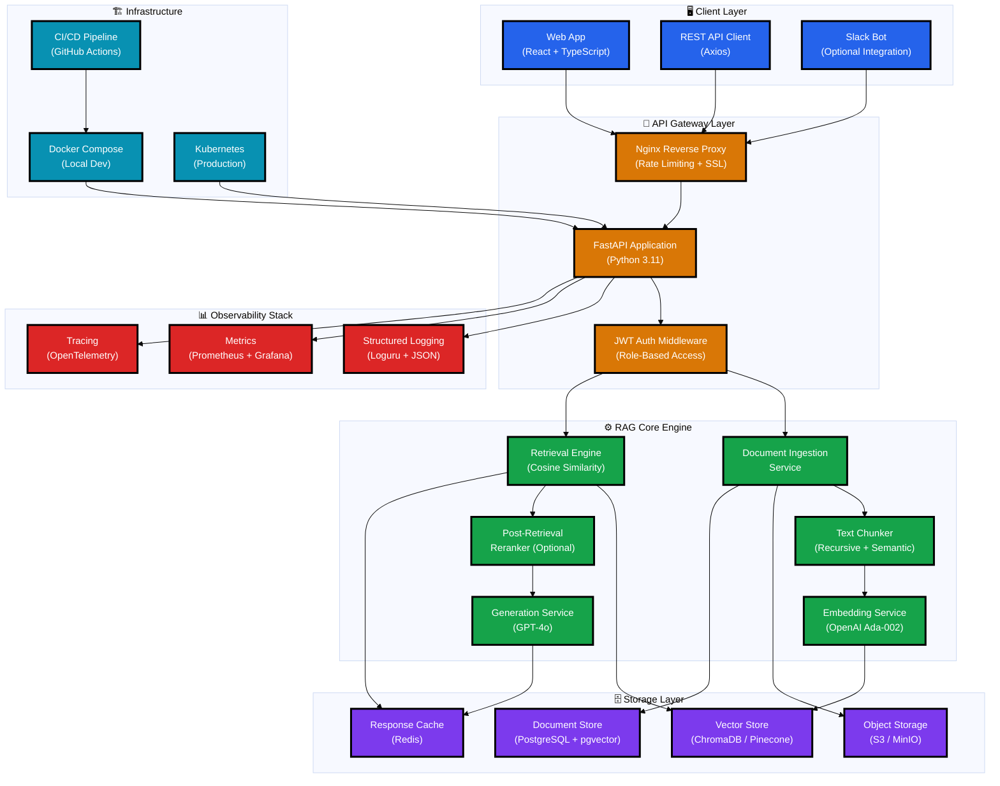
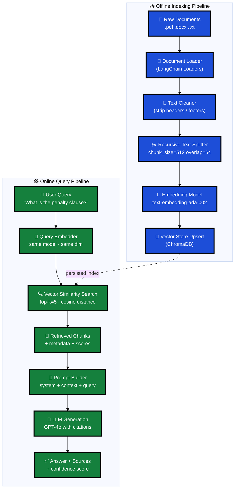
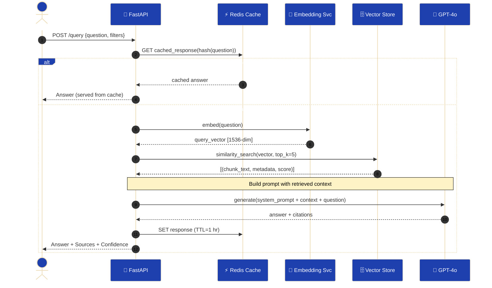
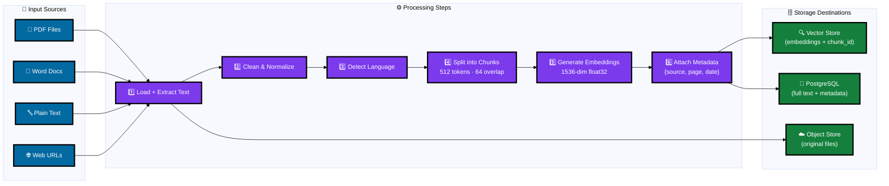

# LegalMind RAG — Naive RAG for Legal Document Q&A

> **Use Case**: A production-grade Naive RAG system for a law firm's internal knowledge base. Lawyers and paralegals ask natural-language questions against thousands of contracts, case files, and regulatory documents — and get cited, source-grounded answers in seconds.

---

## Use Case: LegalMind Q&A System

**Problem**: A mid-size law firm has 50,000+ documents (contracts, briefs, case files, regulatory memos). Associates spend hours manually searching for precedents. Senior partners need instant answers during client calls.

**Solution**: Naive RAG pipeline that ingests all legal documents, embeds them into a vector store, and answers questions with cited source passages — giving lawyers GPT-quality answers grounded in their own documents.

**Key Personas**:
- 🧑‍⚖️ **Associate Lawyer** — searches for precedents, contract clauses
- 👩‍💼 **Paralegal** — extracts facts from large case files
- 🏛️ **Partner** — quick Q&A during client calls

---

## System Architecture

### 1. Full Ecosystem Architecture



---

### 2. Naive RAG Pipeline Architecture



---

### 3. RAG Data Flow Pipeline



---

### 4. Document Ingestion Flow



---

### 5. Component Dependency Graph

```mermaid
%%{init: {'theme': 'base', 'themeVariables': {'fontSize': '15px', 'fontFamily': 'arial'}}}%%
graph LR
    classDef ingStyle  fill:#B45309,stroke:#000,stroke-width:3px,color:#fff
    classDef retStyle  fill:#1D4ED8,stroke:#000,stroke-width:3px,color:#fff
    classDef genStyle  fill:#15803D,stroke:#000,stroke-width:3px,color:#fff
    classDef apiStyle  fill:#DC2626,stroke:#000,stroke-width:3px,color:#fff
    classDef utlStyle  fill:#6B7280,stroke:#000,stroke-width:3px,color:#fff

    subgraph CORE["📦  src/"]
        ING["📥 ingestion/<br/>loader.py<br/>cleaner.py<br/>chunker.py"]
        RET["🔍 retrieval/<br/>vector_store.py<br/>retriever.py<br/>reranker.py"]
        GEN["🤖 generation/<br/>prompt_builder.py<br/>llm_client.py<br/>citation.py"]
        API2["🔀 api/<br/>main.py<br/>routes.py<br/>schemas.py<br/>middleware.py"]
        UTL["🛠️ utils/<br/>config.py<br/>logging.py<br/>metrics.py<br/>cache.py"]
    end

    API2 --> RET
    API2 --> ING
    API2 --> GEN
    RET  --> UTL
    ING  --> UTL
    GEN  --> UTL
    RET  --> GEN

    class ING  ingStyle
    class RET  retStyle
    class GEN  genStyle
    class API2 apiStyle
    class UTL  utlStyle
```

---

## Project Structure

```
naive-rag-project/
├── src/
│   ├── ingestion/
│   │   ├── __init__.py
│   │   ├── loader.py           # Multi-format document loading
│   │   ├── cleaner.py          # Text normalization
│   │   └── chunker.py          # Recursive text splitting
│   ├── retrieval/
│   │   ├── __init__.py
│   │   ├── vector_store.py     # ChromaDB + Pinecone abstraction
│   │   ├── retriever.py        # Similarity search
│   │   └── reranker.py         # Optional cross-encoder rerank
│   ├── generation/
│   │   ├── __init__.py
│   │   ├── prompt_builder.py   # Prompt template engine
│   │   ├── llm_client.py       # OpenAI client wrapper
│   │   └── citation.py         # Source citation extractor
│   ├── api/
│   │   ├── __init__.py
│   │   ├── main.py             # FastAPI app + lifespan
│   │   ├── routes.py           # All API routes
│   │   ├── schemas.py          # Pydantic request/response models
│   │   └── middleware.py       # Auth, logging, rate-limit
│   └── utils/
│       ├── __init__.py
│       ├── config.py           # Settings (Pydantic BaseSettings)
│       ├── logging.py          # Loguru structured logging
│       ├── metrics.py          # Prometheus metrics
│       └── cache.py            # Redis cache wrapper
├── tests/
│   ├── test_ingestion.py
│   ├── test_retrieval.py
│   ├── test_generation.py
│   └── test_api.py
├── scripts/
│   ├── ingest_documents.py     # CLI ingestion entrypoint
│   └── evaluate_rag.py         # RAG evaluation script (RAGAS)
├── data/
│   ├── raw/                    # Raw uploaded documents
│   ├── processed/              # Cleaned text files
│   └── vectorstore/            # ChromaDB persistent store
├── config/
│   ├── settings.yaml
│   └── prompts.yaml
├── docker-compose.yml
├── Dockerfile
├── pyproject.toml
├── .env.example
└── README.md
```

---

## Quick Start

```bash
# 1. Clone and install
git clone https://github.com/yourfirm/legalMind-rag
cd legalMind-rag
pip install -e ".[dev]"

# 2. Set environment variables
cp .env.example .env
# Fill in OPENAI_API_KEY, CHROMA_PATH, POSTGRES_URL

# 3. Start infrastructure
docker-compose up -d  # starts Redis + ChromaDB + PostgreSQL

# 4. Ingest your documents
python scripts/ingest_documents.py --source ./data/raw --recursive

# 5. Start the API
uvicorn src.api.main:app --reload --port 8000

# 6. Query it
curl -X POST http://localhost:8000/query \
  -H "Content-Type: application/json" \
  -d '{"question": "What are the termination clauses in the Smith contract?"}'
```

---

## Environment Variables

| Variable | Description | Default |
|---|---|---|
| `OPENAI_API_KEY` | OpenAI API key | required |
| `EMBEDDING_MODEL` | Embedding model name | `text-embedding-ada-002` |
| `LLM_MODEL` | Generation model | `gpt-4o` |
| `CHROMA_PATH` | ChromaDB persist path | `./data/vectorstore` |
| `CHUNK_SIZE` | Token chunk size | `512` |
| `CHUNK_OVERLAP` | Token overlap | `64` |
| `TOP_K` | Retrieved chunks | `5` |
| `REDIS_URL` | Redis connection | `redis://localhost:6379` |
| `POSTGRES_URL` | PostgreSQL connection | required |

---

## Evaluation

```bash
python scripts/evaluate_rag.py --dataset ./data/eval_set.json
```

Metrics tracked:
- **Faithfulness** — answer grounded in context
- **Answer Relevancy** — answer addresses the question
- **Context Recall** — relevant chunks retrieved
- **Context Precision** — retrieved chunks are relevant