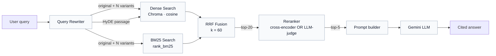
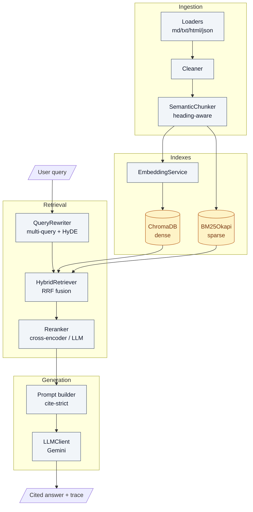

# SupportMind RAG

> **Advanced RAG (Enhanced Retrieval) for customer-support Q&A.**
>
> An end-to-end retrieval pipeline for help-center / knowledge-base search:
> **query rewriting → hybrid search (BM25 + vector) → cross-encoder reranking → cited LLM answer**.

[](https://www.python.org/)
[](https://fastapi.tiangolo.com)
[](https://ai.google.dev/)
[](https://github.com/dorianbrown/rank_bm25)
[](https://opensource.org/licenses/MIT)

---

## Why Advanced RAG?

Naive RAG is a fine MVP — embed query, take top-K cosine, prompt the LLM. It
falls over when:

- **Users mix conversational and technical phrasing.** "my charger isn't
  working" needs to find docs that mention `error E_CHG_002` and `USB-C PD 3.0`.
  Dense embeddings paraphrase exact tokens away; that's where a keyword index
  earns its keep.
- **Top-K cosine is noisy.** A bi-encoder embedding can't read the query and
  the candidate together. A cross-encoder can — and re-orders the wide top-20
  into a precise top-5.
- **One phrasing isn't enough recall.** Asking the LLM for alternate phrasings
  of the same question (multi-query) and embedding a hypothetical answer
  (HyDE) catches passages a single literal embedding misses.

SupportMind glues these techniques into one production-shaped pipeline.

---

## Pipeline at a glance



Each stage is timed independently and its trace is returned in the API
response, so the frontend (and Grafana, via Prometheus) can show **where the
latency lives**.

---

## Live preview

The bundled minimalist console (served at `http://127.0.0.1:8000/`) talks to
the same FastAPI endpoints — ask a question, watch the four-stage pipeline
trace, see which sources came from BM25 vs. dense vs. both:

```
┌─ Pipeline trace ────────────────────────────────────────────┐
│  1. Query rewrite        3 variants + HyDE          0.84 s  │
│  2. Hybrid retrieval     20 dense · 14 sparse → 18 fused    │
│  3. Reranker             5 kept                     llm     │
│  4. Generate             714 tokens                 4.12 s  │
└─────────────────────────────────────────────────────────────┘
```

---

## Project structure

```
supportMind-rag/
├── src/
│   ├── ingestion/
│   │   ├── loaders.py            # md / txt / html / json
│   │   ├── cleaner.py            # normalize unicode + whitespace
│   │   ├── chunker.py            # SemanticChunker + recursive baseline
│   │   └── pipeline.py           # load → clean → chunk → index
│   ├── retrieval/
│   │   ├── embeddings.py         # provider-aware embedding service
│   │   ├── vector_store.py       # ChromaDB dense store
│   │   ├── bm25_index.py         # persisted BM25 keyword index
│   │   ├── query_rewriter.py     # multi-query + HyDE
│   │   ├── reranker.py           # cross-encoder OR LLM-as-judge
│   │   └── hybrid_retriever.py   # rewrite → hybrid → RRF → rerank
│   ├── generation/
│   │   ├── prompts.py            # cite-strict system prompt
│   │   ├── llm_client.py         # AsyncOpenAI (OpenAI / Gemini compat)
│   │   └── generator.py          # full envelope w/ per-stage trace
│   ├── api/
│   │   ├── main.py               # FastAPI app, CORS, static, lifespan
│   │   ├── routes.py             # /ingest, /query, /health, /stats
│   │   └── schemas.py            # pydantic request / response models
│   └── utils/
│       ├── config.py             # pydantic-settings, env-driven
│       ├── logging.py            # loguru + correlation IDs
│       └── metrics.py            # prometheus per-stage histograms
├── data/
│   ├── raw/sample_kb/            # 6 example support articles
│   ├── vectorstore/              # Chroma persistence (gitignored)
│   └── bm25/                     # BM25 pickle (gitignored)
├── tests/                        # pytest-asyncio
├── web/index.html                # minimalist single-file console
├── pyproject.toml
├── .env.example
└── README.md
```

---

## Architecture



---

## The four advanced techniques

### 1. Query rewriting — multi-query + HyDE

`src/retrieval/query_rewriter.py` runs two LLM calls in parallel:

- **Multi-query.** Asks the LLM for N alternate phrasings of the user
  question. Each variant becomes its own dense + sparse query; results are
  union'd before fusion. Fixes the "user phrasing ≠ doc phrasing" gap.
- **HyDE (Hypothetical Document Embeddings).** Asks the LLM for a *plausible*
  answer to the question, then embeds **that answer** instead of the question.
  The embedding lands in answer-space — much closer to relevant chunks.

HyDE is excluded from BM25 — a hypothetical answer dilutes rare-term keyword
signal rather than helping it.

### 2. Hybrid search — BM25 + dense, fused via RRF

`src/retrieval/bm25_index.py` runs `BM25Okapi` over a tokenizer that
deliberately preserves technical tokens: `E_CHG_002`, `v2.4.3`, `usb-c`,
`wi-fi`, `ssh-keygen` survive intact. The index is pickled to disk so
cold-start is `pickle.load`, not retokenize-the-world.

`src/retrieval/hybrid_retriever.py` runs both retrievers in parallel and fuses
them with **Reciprocal Rank Fusion**:

```
RRF_score(d) = Σ_q 1 / (k + rank_q(d))     (k = 60)
```

RRF doesn't need score calibration between BM25 (0–∞) and cosine (0–1) — it
looks at **rank position**, not raw score. The sum is over every query
(original + variants + HyDE).

### 3. Reranking — cross-encoder OR LLM-as-judge

`src/retrieval/reranker.py` ships two backends behind one interface:

- **Cross-encoder** — `sentence-transformers` model
  (`cross-encoder/ms-marco-MiniLM-L-6-v2` by default). Reads
  `(query, candidate)` jointly, catches signals a bi-encoder misses. Heavy
  dep (torch); install via the `[rerank]` extra.
- **LLM-as-judge** — sends the query + numbered candidates to the configured
  LLM and asks for relevance scores. No torch dep, runs anywhere. Slower per
  call but zero local compute.

Toggle with `RERANKER_BACKEND={cross_encoder,llm,off}`.

### 4. Chunk optimization — heading-aware semantic chunker

`src/ingestion/chunker.py::SemanticChunker` splits markdown KB articles on
heading boundaries (h1 → h6), packs sentences within each section up to
`chunk_size`, and **never splits a fenced code block**. Each chunk gets a
`section_path` breadcrumb (e.g. `Setup > Wi-Fi > Reset router`) prefixed onto
the text — the dense embedding gets extra context, BM25 gets more keyword
signal, and the API can show the breadcrumb in the source list.

The recursive baseline chunker is still in the file; flip
`SEMANTIC_CHUNKING=false` for ablation.

---

## Quickstart

```bash
git clone <this repo>
cd supportMind-rag

# Editable install (Python 3.11+)
pip install -e .

# Configure
cp .env.example .env
# edit .env — set GEMINI_API_KEY (or OPENAI_API_KEY + flip LLM_PROVIDER)

# Run
uvicorn src.api.main:app --reload --port 8000
```

Open `http://127.0.0.1:8000/` for the console, `http://127.0.0.1:8000/docs`
for OpenAPI.

### Ingest the sample knowledge base

```bash
curl -X POST http://127.0.0.1:8000/api/v1/ingest \
  -H "Content-Type: application/json" \
  -d '{"path": "./data/raw/sample_kb", "recursive": true}'
```

Returns a per-file count and elapsed time. Both the dense store and the BM25
index are populated in lock-step.

### Ask a question

```bash
curl -X POST http://127.0.0.1:8000/api/v1/query \
  -H "Content-Type: application/json" \
  -d '{"query": "What does error E_FW_017 mean and how do I fix it?"}'
```

The response includes the full pipeline trace:

```jsonc
{
  "answer": "E_FW_017 means the downloaded firmware image failed signature verification… [Source 1]",
  "sources": [ /* numbered, one per [Source N] reference */ ],
  "retrieval": {
    "rewriter": {
      "original": "What does error E_FW_017 mean and how do I fix it?",
      "variants": ["Firmware update error E_FW_017 troubleshooting", "..."],
      "hyde_passage": "E_FW_017 indicates a signature mismatch during firmware verification…",
      "elapsed_s": 0.84
    },
    "dense_candidates": 20,
    "sparse_candidates": 14,
    "fused_top": [ /* with dense_score, sparse_score, contributing_queries */ ],
    "reranked_top": [ /* final top-5, with rerank_score */ ],
    "reranker": "llm",
    "elapsed_s": 2.71
  },
  "generation": { "model": "gemini-2.5-flash-lite", "total_tokens": 714, "..." },
  "total_elapsed_s": 4.12
}
```

---

## Endpoints

| Method | Path                | Purpose                                                 |
|-------:|---------------------|---------------------------------------------------------|
| POST   | `/api/v1/ingest`    | Walk a path, chunk, index in dense + BM25                |
| POST   | `/api/v1/query`     | Run rewrite → hybrid → rerank → generate; return trace   |
| GET    | `/api/v1/health`    | Liveness probe + index sizes                             |
| GET    | `/api/v1/stats`     | Active models, backends, sizes, knobs                    |
| GET    | `/metrics`          | Prometheus exposition (per-stage histograms)             |
| GET    | `/`                 | Redirects to `/app/` (the bundled console)               |
| GET    | `/docs`             | OpenAPI / Swagger UI                                     |

---

## Configuration

Every knob is env-driven via `pydantic-settings`. The high-leverage ones:

| Variable                  | Default                                  | Effect |
|---------------------------|------------------------------------------|--------|
| `LLM_PROVIDER`            | `gemini`                                 | `gemini` (OpenAI-compat) or `openai` |
| `GEMINI_MODEL`            | `gemini-2.5-flash-lite`                  | Chat model (cheap + fast for support) |
| `GEMINI_EMBEDDING_MODEL`  | `gemini-embedding-001`                   | 3072-dim |
| `SEMANTIC_CHUNKING`       | `true`                                   | Heading-aware chunker vs. recursive baseline |
| `QUERY_REWRITE_ENABLED`   | `true`                                   | Toggle multi-query rewrite |
| `QUERY_REWRITE_VARIANTS`  | `3`                                      | How many alternate phrasings to generate |
| `HYDE_ENABLED`            | `true`                                   | Generate hypothetical answer for embedding |
| `DENSE_TOP_K`             | `20`                                     | Wide candidates from Chroma per query |
| `SPARSE_TOP_K`            | `20`                                     | Wide candidates from BM25 per query |
| `RRF_K`                   | `60`                                     | RRF dampening constant (Cormack et al.) |
| `HYBRID_TOP_K`            | `20`                                     | Candidates passed into the reranker |
| `RERANKER_BACKEND`        | `llm`                                    | `cross_encoder`, `llm`, or `off` |
| `CROSS_ENCODER_MODEL`     | `cross-encoder/ms-marco-MiniLM-L-6-v2`   | Used when backend is `cross_encoder` |
| `FINAL_TOP_K`             | `5`                                      | Sources sent to the LLM |

---

## Tests

```bash
pip install -e ".[dev]"
pytest -q
```

Coverage focuses on the new advanced-RAG components:

- `test_chunker.py` — heading detection, section breadcrumbs, code-block
  preservation
- `test_bm25.py` — tokenizer preserves technical strings, ranking by exact
  terms
- `test_hybrid_retriever.py` — RRF fusion math (chunks in both lists outscore
  singletons; sums across query variants)
- `test_query_rewriter.py` — JSON / fenced / line-split parser, parallel
  multi-query + HyDE

---

## Observability

Each pipeline stage has its own Prometheus histogram:

```
supportmind_query_rewrite_latency_seconds
supportmind_dense_search_latency_seconds
supportmind_sparse_search_latency_seconds
supportmind_fusion_latency_seconds
supportmind_rerank_latency_seconds
supportmind_generation_latency_seconds
supportmind_retrieval_total_latency_seconds
```

Plus counters for tokens, errors, and gauges for index sizes. Drop these into
a Grafana board and the bottleneck stage shows up immediately.

Every API response carries `X-Correlation-ID` (round-tripped from the request
header if present, otherwise generated). Loguru tags every log line with the
same ID so you can grep one query through the entire pipeline.

---

## Use cases

- **Customer-support knowledge bases** — the canonical fit. Conversational
  queries against precise documentation.
- **Internal helpdesk / IT runbooks** — exact error codes + procedures.
- **Developer documentation search** — symbol names + version numbers + prose.
- **Compliance / policy Q&A** — precise terminology that BM25 must not
  paraphrase away.
- **E-commerce product search** — model numbers + descriptions.

Anywhere the query and the document drift on vocabulary while the *intent*
stays the same is exactly where the four techniques compound.

---

## License

MIT.
